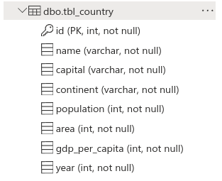
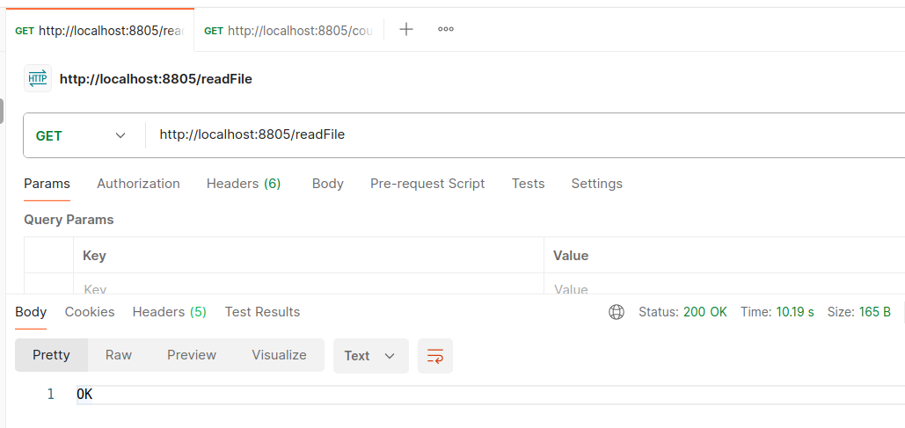

READING A FILE AND STORING IT IN AZURE SQL
----------------------------------------------------

----------------------------------------------------

Table created in Azure SQL:

----------------------------------------------------

Endpoint exposed to read a file:

----------------------------------------------------

Data loaded in the table:

----------------------------------------------------