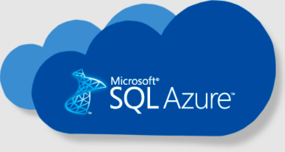
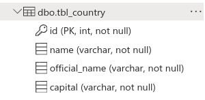
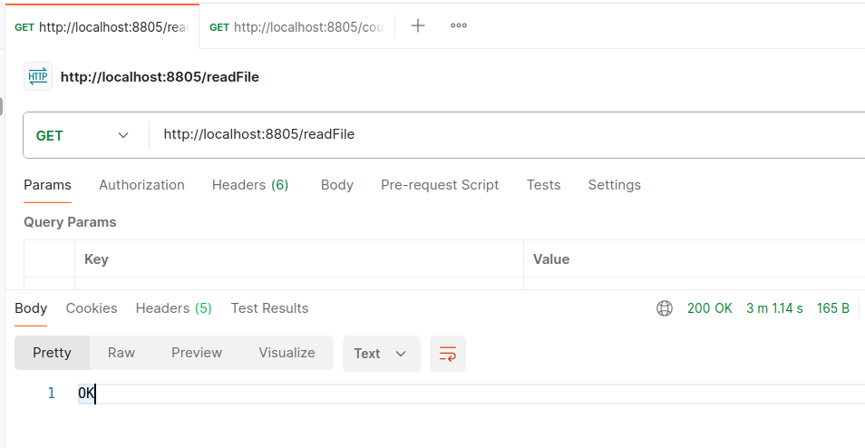
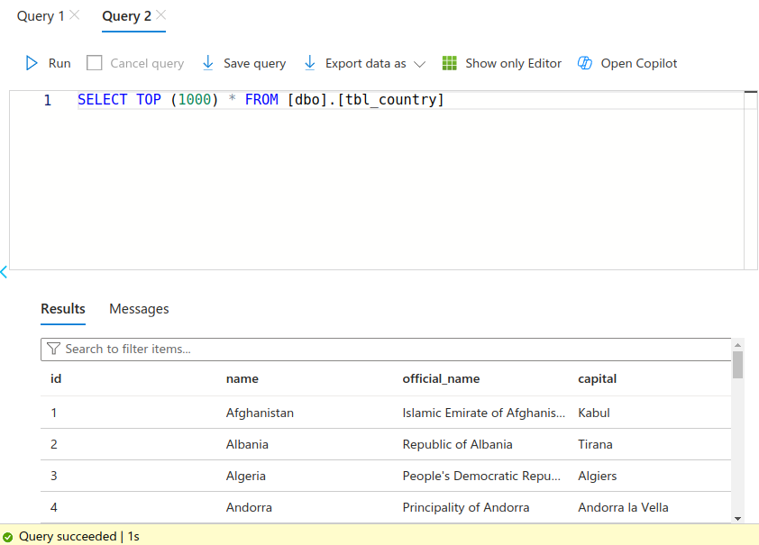
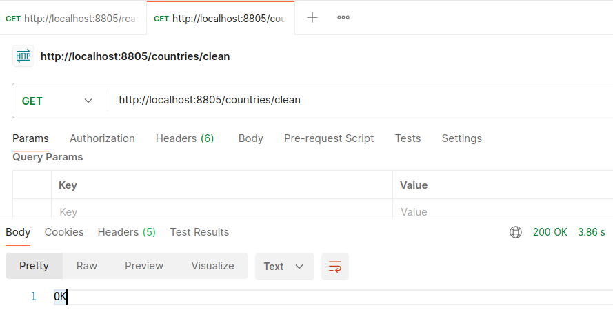

READING A FILE AND STORING IT IN AZURE SQL
----------------------------------------------------

----------------------------------------------------

**Table created in Azure SQL:**

----------------------------------------------------

**Endpoint exposed to read content from a file:**

----------------------------------------------------

**Data loaded in the table:**

----------------------------------------------------

**Endpoint exposed to clean data from db:**

----------------------------------------------------
